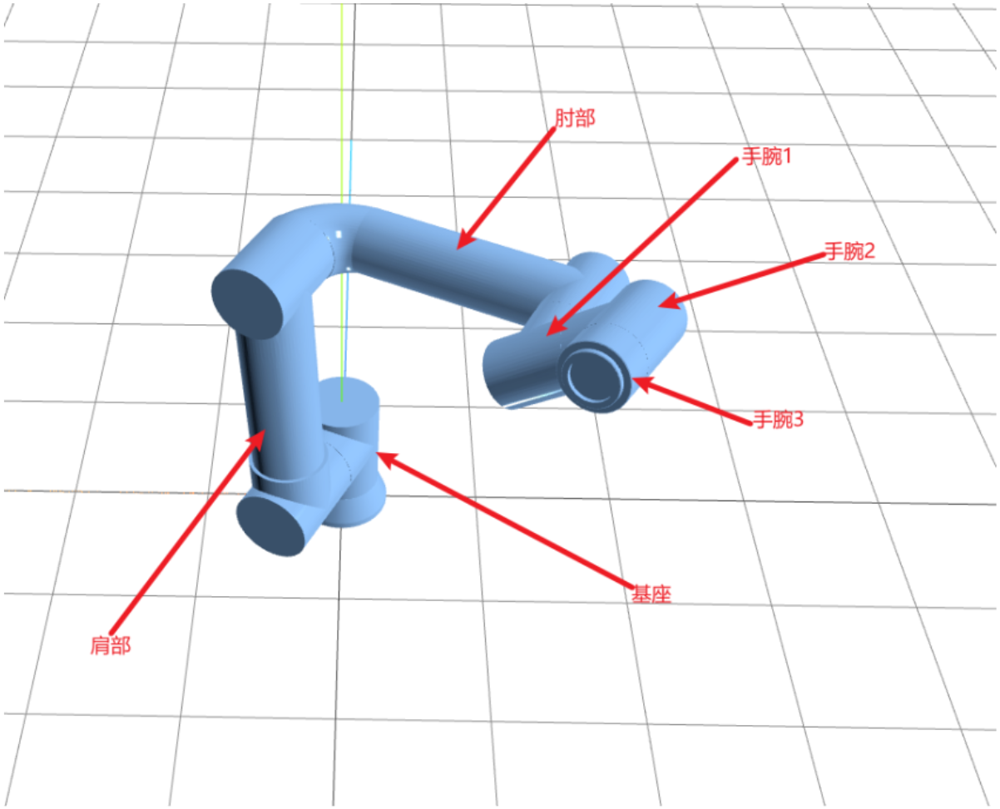

# 机械臂仿真项目

### 技术栈

1. vite
2. vue3
3. Threejs

### 实现的功能

1. 手动调整机械臂各个关节的运动
2. 连接和断开机械臂设备
3. 回到初始视角位置
4. 动作模拟

### 机械臂要点

actual_pos 数据结构

```JavaScript
actual_pos [1.1046747520317388, -1.5141579898313877, -1.6297835540520333, -0.4636527600091554, 0.863356721232929, 0.012559659131761654] 
```

机械臂结构 

1. 与机械臂建立连接，返回的数据，其中用到的数据（actual_pos）是一个数组，表示机械臂各个模块的弧度值
2. 大约每隔 1s 接收一次数据
3. 这些模块从下到上分别为（基座、肩部、肘部、手腕 1、手腕 2、手腕 3）
4. 弧度的取值范围是-2Π 到 2∏，弧度值从 0 到 2Π，就是转了一整圈
5. 肩部弧度值为-0.5Π 时，处于直立状态，肘部弧度值为 0 时，处于直立状态，手腕 1 弧度值为-0.5Π 时，处于直立状态
6. 相对于基座，肩部、肘部、手腕 1 是垂直旋转的

### 使用 Threejs 动态渲染机械臂

首先创建场景、相机和渲染器，渲染器负责渲染场景和相机

##### 在场景创建之后，即可做以下事情：

1. 解析加载 3d 模型
2. 创建并添加光线
3. 创建并添加辅助线
4. 创建并添加网格地板

##### 在相机和渲染器创建之后，即可做以下事情：

1. 创建并使用控制器

##### 在场景、相机和渲染器创建之后，并且渲染器被添加到页面之后，即可做以下事情：

1. 渲染画面（renderer.render(scene, camera)）
